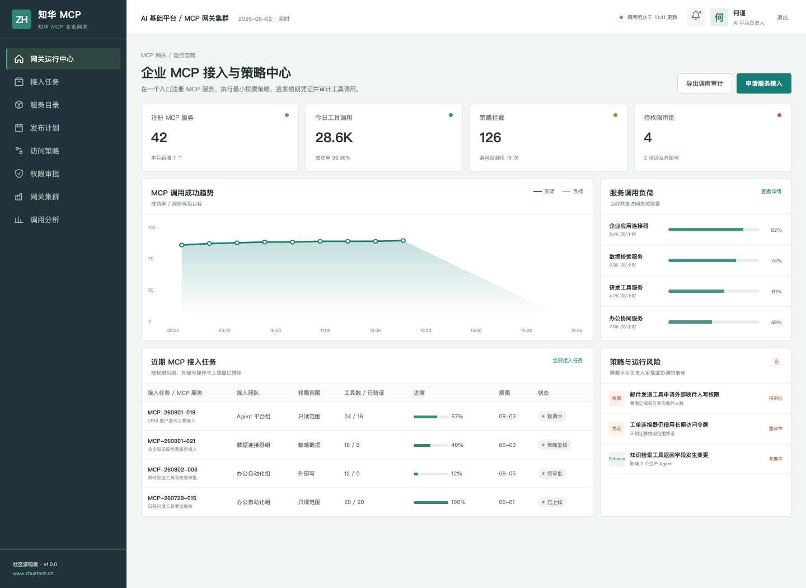
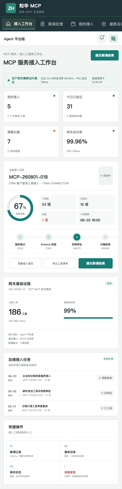

# ZhuaTech MCP Gateway

> 企业 Agent 的工具接入层：一处注册、统一授权、短期凭证、全程审计。

ZhuaTech MCP Gateway 是上海如静知华信息科技有限公司推出的 MCP 服务治理开源参考工程。它不替代具体 MCP Server，而是在 Agent 与企业工具之间提供可靠的目录、策略和运行控制面。[了解知华科技](https://www.zhuatech.cn/)

## 一次工具调用如何通过网关

```text
Agent / 用户
   │ 身份、服务、工具、参数摘要
   ▼
MCP Gateway ── 服务注册表 ── Schema 校验
   │
   ├─ 策略：主体 × 工具 × 参数 × 数据范围
   ├─ 凭证：按服务和工具签发短期权限
   └─ 审计：决策、耗时、结果和追踪编号
   ▼
企业 MCP Server
```

社区版内置确定性的最小权限判定接口 `POST /api/shopfloor/access-decision`，可对未注册服务、长期凭证、敏感数据和外部写操作返回 `ALLOW / REVIEW / BLOCK`。

## 产品预览



上图是网关管理端：运营人员可查看服务调用趋势、接入任务、策略拦截、权限审批以及集群健康情况。



移动工作台为接入工程师提供 Schema 联调、策略结果、服务目录和风险审批入口。

## 已实现模块

- MCP Server 与 Tool 目录、版本和负责人管理
- 接入任务、Schema 校验、沙箱联调与灰度流程
- 主体、角色、工具、参数及数据范围策略
- 高风险外部写操作审批和职责分离
- 网关实例、限流、延迟、错误率与审计流水
- JWT 认证、角色权限、MySQL 持久化和演示模式

技术栈为 Java 21 + Spring Boot + MySQL 8，以及 Vue 3 + Vite 的桌面管理端和 H5。Java 包名：`cn.zhuatech.mcpgateway`。

## 本地启动

只查看交互演示：

```bash
cd frontend
npm install
npm run dev:demo
```

访问 `http://localhost:5173`，管理端账号 `planner / Demo@2026`，接入端账号 `operator / Demo@2026`。生产模式和 API 说明参见 [deploy/README.md](deploy/README.md)与 [docs/api.md](docs/api.md)。仓库中没有任何真实凭证，接入外部服务时应使用环境变量或专用密钥系统。

## 非商业使用声明

该工程仅能用于个人学习、研究和非商业交流，**未经授权不得商用**。企业内部部署、生产运行、SaaS、项目交付、商业培训、咨询实施、二次品牌发行等用途，均须获得上海如静知华信息科技有限公司书面授权，以 [LICENSE](LICENSE) 为准。

深度开发、MCP Server 集成、网关私有化及企业 Agent 平台建设，请访问[知华科技官网](https://www.zhuatech.cn/)或添加微信：

| MCP 与 Agent 平台 | 项目定制与授权 |
| --- | --- |
|  |  |

关键词：MCP Gateway、Model Context Protocol 网关、MCP 服务治理、Agent 工具权限、MCP 审计、Java MCP 平台、知华科技。
